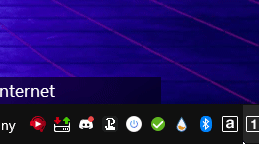

# TP-GoveePlugin
This Plugin is built for [TouchPortal](https://www.touch-portal.com/assetsdb/show-all.php?cat=pl)

## Summary
This Plugin is used for [TouchPortal](https://www.touch-portal.com)
This Plugin has ability to control Wi-Fi connected lights Govee Lights Only for list of models here:  
H6160, H6163,H6104, H6109, H6110, H6117, H6159, H7021, H7022,  
H6086, H6089,H6182, H6085, H7014, H5081, H6188, H6135, H6137,  
H6141, H6142,H6195, H7005, H6083, H6002, H6003, H6148, H6052,  
H6143,H6144,H6050,H6199,H6054,H5001

## How do i know If this works with one of my lights?
Check the manual of your Lights and look for the model if you don't see
your lights model in that list then that means it will not work.

# Actions and States

## Actions

* Turn Device Off and On
* Change Color
* Change Color Temperature
* Change Brightness

## States

* Get Devices Color
* Get Devices Online States
* Get Devices Brightness
* Get Devices Power State

# Getting API Key from Govee
An API key is needed in order for this plugin to work. To get the API key you have to have a account that is linked to the device you would like to use with the plugin.
1. On any mobile device that have Govee Home APP if you don't have it install you can get it from the [Google Play Store](https://play.google.com/store/apps/details?id=com.govee.home) or the [Apple App Store](https://apps.apple.com/us/app/govee-home/id1395696823).
2. Click User it should be the 4th icon on the bottom.  

3. Click the Cog icon in the top right.  

4. Click the last option About Us.  

5. Click Apply for API Key.  

6. Fill out the form and click submit.  

7. Govee will send you a email with API key in a email associated with your account.  
*it should say "Your API Key is XXXXXX-XXX-XXXX-XXXX-XXXXXXX"  

8. Note the API key down as you will need it later for the installation.

# Installation
1. Go to <a target="_blank" href="https://github.com/KillerBOSS2019/TP-GoveePlugin/releases" > Releases </a> on the main page of this github.
2. Make sure download Win-TPGoveePlugin.tpp. *Note: Currently This Plugin is ONLY for Windows Mac will have this later.*  
3. After you have the file head over to touchportal app on your PC.
4. On the top right click the wrench icon.  

5. Click `Import plugin-in...` and select the .tpp file you've downloaded in step 2.
6. Exit TouchPortal.  

7. Relaunch TouchPortal. When you do you will get a Warning prompt, Just click the Always Trust button.  

8. A GUI will pop up that asking you to input Govee API Key.
9. Put in your API Key and click the ok button.  

10. You will receive a confirmation that it was successful. After which you are good to go and can start using the plugin.  

